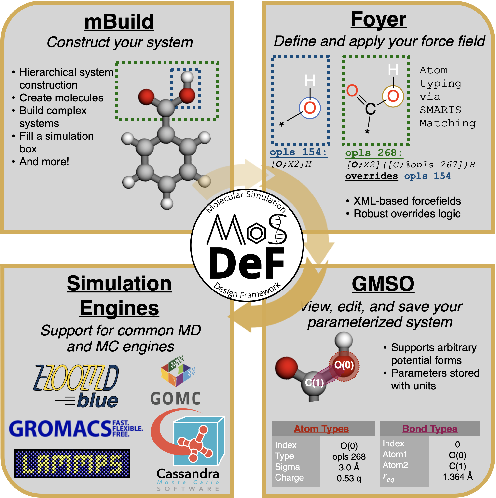

# MoSDeF - The Molecular Simulation Design Framework

The Molecular Simulation and Design Framework (MoSDeF) is a collection of open-source tools ([hosted on Github](
https://github.com/mosdef-hub)) aims at facilitating the construction and simulation of complex molecular systems - 
with a particular focus on the automated screening of large structural parameter spaces. All tools are written as 
Python packages and feature a Python-based API.

The MoSDeF software suite consist of three core libraries, namely [mBuild](https://github.com/mosdef-hub/mbuild.git), 
[Foyer](https://github.com/mosdef-hub/foyer.git), and [GMSO](https://github.com/mosdef-hub/gmso.git). Each library dedicates to handle a certain step of the chemical system initialization process, as summarized in the figure below.

<p align="center">
  
</p>

Libraries in the MoSDeF ecosystem are designed to provide utilities necessary to streamline
a researcher's simulation workflow. When setting up simulation studies, we also recommend users to 
follow the [TRUE](https://www.tandfonline.com/doi/full/10.1080/00268976.2020.1742938)
(Transparent, Reproducible, Usable-by-others, and Extensible) standard, which is a set of common
practices meant to improve the reproducibility of computational simulation research.

# This Workshop

Due to time constraint, this workshop could not cover all the details and features that offers by the MoSDeF 
tools. However, we will visit several key data structures and features that would allow new users to quickly 
onboard and start using MoSDeF on their research. Together, we will walk through a set of tutorials, focus on
individual tools in the software suite, namely [`mBuild`](https://github.com/mosdef-hub/mbuild), [`Foyer`](
https://github.com/mosdef-hub/foyer) and [`GMSO`](https://github.com/mosdef-hub.gmso). These tutorials will
be presented in a series of Jupyter notebook, which participants can choose to download and fire up these 
notebooks locally or access it through [Mybinder](https://mybinder.org/v2/gh/mosdef-hub/FOMMS-workshop/HEAD).
If you choose to download the tutorials and host them locally, please follow the installation instruction below.

## Installation 
Follow the command below to clone and create the `conda` environment for this repository:
```sh
git clone https://github.com/mosdef-hub/fomms-workshop.git
cd fomms-workshop

conda env create -f environment.yml
conda activate mosdef-workshop

jupyter notebook
```

## Mybinder [](https://mybinder.org/v2/gh/mosdef-hub/FOMMS-workshop/HEAD)

Follow the image above to test this repository through the Mybinder service, or follow this link:
https://mybinder.org/v2/gh/mosdef-hub/FOMMS-workshop/HEAD


<p align="center">
   
  &emsp;&emsp;&emsp;&emsp;&emsp;&emsp;&emsp;&emsp;&emsp;&emsp;&emsp;
  
</p>